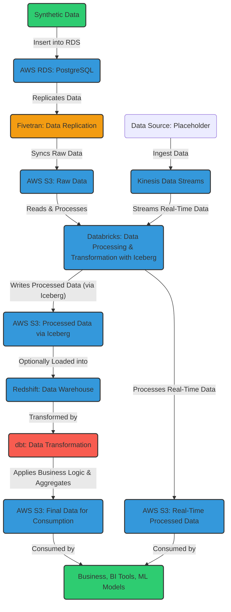

# Modern Data Pipeline
This project demonstrates a data pipeline using **AWS RDS**, **Fivetran**, **Databricks**, **dbt**, and **Apache Iceberg**. The pipeline includes batch processing of synthetic data and real-time streaming with **AWS Kinesis** as a placeholder.

# Architecture Overview
1. **Synthetic Data**: Generate synthetic data using Python in CSV format.
2. **AWS RDS**: Load dataset into **PostgreSQL**.
3. **Fivetran**: Replicate data from AWS RDS to **AWS S3** (raw data) in real-time.
4. **Databricks**: Process the raw data using **Databricks**, perform transformations, and write the processed data back to S3 via **Apache Iceberg** (for schema evolution and partitioning).
5. **dbt**: Transform the processed data in S3 to apply business logic, clean, and aggregate data for consumption.
6. **AWS Kinesis (placeholder)**: Stream real-time data into Databricks via **AWS Kinesis**, process it, and store the results in **AWS S3** for real-time consumption.

# Data Flow


# Setup Instructions
## Step 1: Generate Synthetic Data
1. Install dependencies ```pip install faker pandas```
2. Run ```generate.py``` to generate CSV files
## Step 2: Set Up AWS RDS
1. Create a PostgreSQL RDS instance.
2. Ensure public access and configure security groups for inbound connections on port 5432.
3. Load CSV data into RDS using psql or a database client.
## Step 3: Set Up Fivetran
1. Sign up for Fivetran and create a PostgreSQL connector.
2. Enter RDS credentials (hostname, username, password) and connect Fivetran.
3. Set up an S3 bucket as the destination and configure sync frequency.
