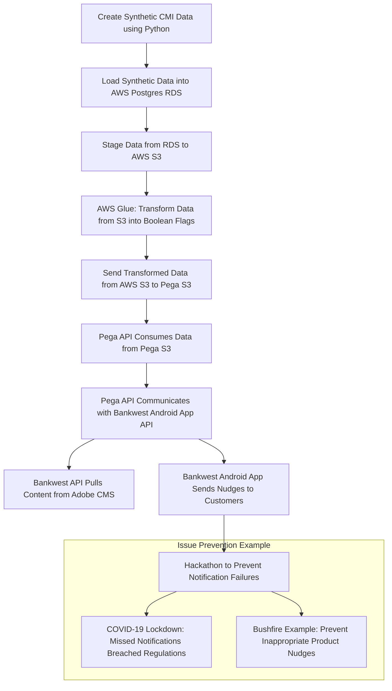

Given that the data is staged in S3 before using AWS Glue, here’s the revised flow:

### Revised Plan:

1. **Create synthetic CMI data using Python**.
2. **Load synthetic data into AWS Postgres RDS**.
3. **Stage the synthetic data from RDS to AWS S3**.
4. **Use AWS Glue to transform the staged data from S3** into Boolean flags based on the campaign analytics team’s criteria.
5. **Send the transformed data from AWS S3 to Pega's S3**.
6. **Pega API consumes data from Pega's S3**.
7. **Pega API communicates with Bankwest Android app API** to send notifications (nudges) based on the transformed data.
8. **Bankwest Android App API sends data to Adobe CMS** for additional content management.

### Revised Mermaid Code:

This revised flow stages the data in S3, where AWS Glue processes it, and then continues with the data being sent to Pega for further action. This structure reflects your plan better and maintains the logic of using S3 as an intermediary step. Does this updated version work for you?

Here’s a draft pitch deck structure for your PowerPoint presentation on the hackathon, complete with slide suggestions and talking points. You can adapt this for your speech as well.

---

### **Slide 1: Title Slide**
**Title**: Hackathon Presentation: Customer Notifications & Campaign Intelligence  
**Subtitle**: Enhancing Targeted Campaigns and Regulatory Compliance  
**Presented by**: Alan [Your Last Name]  
**Date**: [Insert Date]

---

### **Slide 2: Agenda**
1. Introduction
2. The Problem: Missed Notifications
3. Hackathon Solution Overview
4. Technical Process Flow
5. Key Benefits & Impact
6. Lessons Learned & Next Steps

---

### **Slide 3: Introduction**
**Title**: Introduction to the Hackathon  
**Talking Points**: 
- Overview of the hackathon and its objectives.
- Focus on addressing missed notifications during critical events (like COVID-19) and improving targeted campaigns.

---

### **Slide 4: The Problem: Missed Notifications**
**Title**: The Problem: Missed Customer Notifications  
**Talking Points**:
- During the COVID-19 lockdown, some Bankwest customers did not receive critical notifications (branch closures).
- A breach of regulatory requirements as a bank. 
- Potential for inappropriate notifications during sensitive times (e.g., bushfires).
- The goal was to build a smarter notification system that would prevent these issues.

---

### **Slide 5: Hackathon Solution Overview**
**Title**: Hackathon Solution Overview  
**Talking Points**: 
- Designed a data pipeline to ensure targeted and intelligent customer notifications.
- Integrated multiple platforms: AWS RDS, S3, Glue, and the Pega decisioning platform.
- Leveraged synthetic data to simulate real-world campaigns (new products, birthdays, disaster alerts, etc.).
- **Key goal**: Ensure customers receive timely, relevant notifications based on circumstances.

---

### **Slide 6: Technical Process Flow**
**Title**: Technical Process Flow  
**Talking Points**:
- High-level view of the end-to-end flow (Python > RDS > S3 > Glue > Pega > Bankwest Android App).
- **Process Summary**:
  1. Create synthetic CMI data in Python.
  2. Load data into AWS Postgres RDS.
  3. Stage data to S3 for processing.
  4. Use AWS Glue to transform data into Boolean flags for campaign targeting.
  5. Send transformed data to Pega’s S3 for intelligent decisioning.
  6. Pega API interacts with Bankwest Android App to send nudges and with Adobe CMS for content management.

---

### **Slide 7: Process Flow Diagram**
**Title**: Process Flow Diagram  
**Talking Points**:
- Show the **Mermaid flowchart** on the slide.
- Walk through each stage of the process.
- Emphasize the integration of platforms and how data flows seamlessly between them.

---

### **Slide 8: Key Benefits & Impact**
**Title**: Key Benefits & Impact  
**Talking Points**:
- **Regulatory Compliance**: Ensures all customers receive important notifications.
- **Targeted Campaigns**: Customers only receive relevant notifications, avoiding inappropriate nudges.
- **Improved Customer Experience**: Personalized messages based on circumstances, enhancing trust in the bank.
- **Scalable Solution**: The infrastructure is scalable for future campaigns.

---

### **Slide 9: Example Use Cases**
**Title**: Example Use Cases  
**Talking Points**:
- **COVID-19 Notification Issue**: Example of a missed notification that could have been prevented.
- **Bushfire Notification**: Avoid sending irrelevant product offers during a crisis.
- **Birthday Campaigns**: Customers receive offers on their birthdays, enhancing engagement.

---

### **Slide 10: Lessons Learned**
**Title**: Lessons Learned  
**Talking Points**:
- Importance of testing for real-time and emergency notifications.
- Challenges with integrating multiple platforms and ensuring data consistency.
- Ensuring the system remains adaptable to new campaign types and regulatory changes.

---

### **Slide 11: Next Steps**
**Title**: Next Steps  
**Talking Points**:
- Further testing and validation of the solution in real-world scenarios.
- Exploring additional customer segments for more personalized notifications.
- Refining the integration between AWS Glue and Pega to optimize performance.
- Rollout of the solution across other communication channels (email, SMS).

---

### **Slide 12: Thank You / Q&A**
**Title**: Thank You  
**Talking Points**:
- Invite questions from the audience.
- Offer to dive deeper into specific parts of the hackathon solution or its technical aspects.

---

This structure gives you a good narrative flow that emphasizes both the problem you solved and the technical solution. Each slide gives you a talking point that you can expand upon during your presentation.
